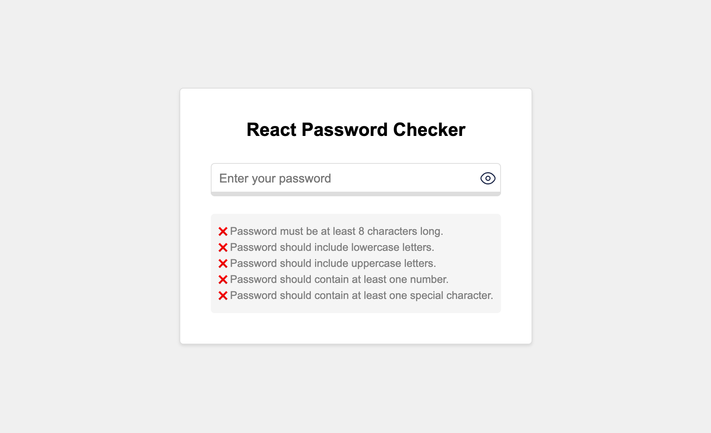
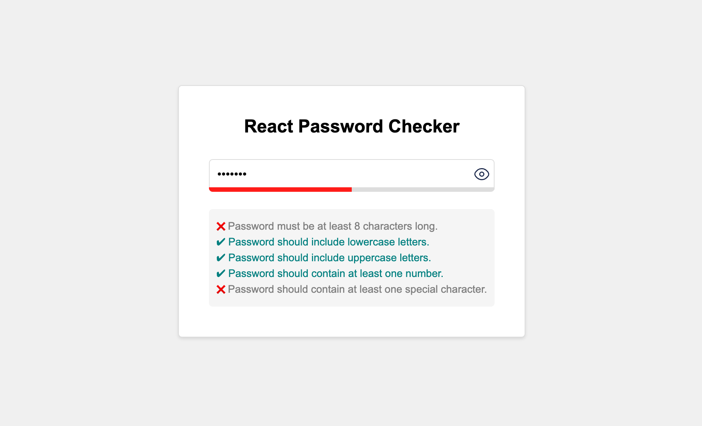

# React Password Checker




A user-friendly web application that assesses and provides feedback on the strength of your password.

**Features include:**

- secure password input field
- toggle to view or hide the password
- real-time feedback on password strength.

## Built With

React/JavaScript
Vite

## Live Demo

Live link

## Prerequisites

Node.js and npm (Node Package Manager)

## Installing

To set up a development environment:

1. Clone the repository

```sh
git clone https://github.com/samuelurom/credit-card-detector
```

2. Navigate to the project directory

```sh
cd credit-card-detector
```

3. Install dependencies

```sh
npm install
```

4. Run the application

```sh
npm run dev
```
